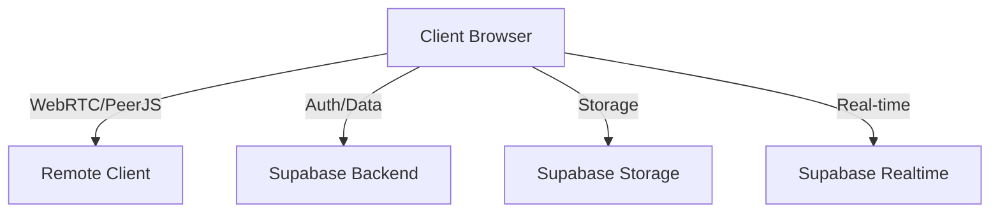
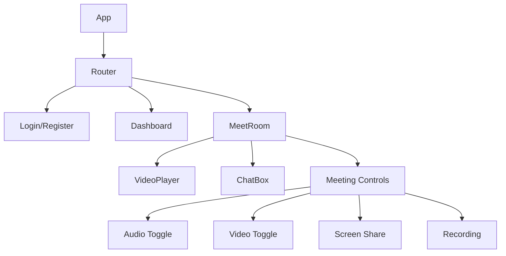
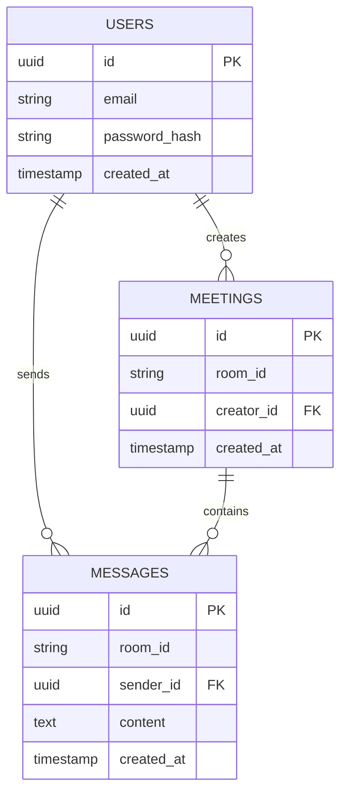

# Patterns Système de MiniMeet

## Architecture Globale

MiniMeet adopte une architecture moderne basée sur les principes suivants:

1. **Architecture Client-centrée**: Application React avec état client
2. **Communication P2P**: Connexions WebRTC directes entre utilisateurs
3. **Backend Serverless**: Utilisation de Supabase pour l'authentification et le stockage
4. **Design Modulaire**: Composants React réutilisables et découplés

## Patterns de Conception

### Pattern MVC Adapté
- **Modèle**: Services Supabase et hooks de données
- **Vue**: Composants React et UI
- **Contrôleur**: Context API et hooks personnalisés

### Gestion d'État
- **Context API** pour l'état global (auth, préférences)
- **Local State** avec hooks useState pour l'état des composants
- **Props Drilling** minimisé par l'utilisation de contextes

### Communication P2P
- **Pattern Observer** pour les événements PeerJS
- **Pattern Pub/Sub** pour la gestion des messages et des flux média

### Gestion de l'Authentification
- **Pattern Redirect** pour les routes protégées
- **Pattern Guard** pour l'accès aux fonctionnalités restreintes
- **JWT** pour la persistance de session

## Composants Principaux et Relations

### Interactions Clés

1. **Création de Réunion**:
   - Génération d'ID unique
   - Enregistrement dans Supabase
   - Initialisation de PeerJS

2. **Participation à une Réunion**:
   - Connexion à un ID existant
   - Établissement de connexion P2P
   - Échange de flux média

3. **Chat en Temps Réel**:
   - Abonnement à un canal Supabase
   - Envoi/réception de messages
   - Persistance dans la base de données

4. **Enregistrement**:
   - Capture du flux média local/distant
   - Traitement via MediaRecorder
   - Génération de fichier téléchargeable

## Patterns de Données

### Structure de Base de Données

## Patterns d'Interaction Utilisateur

- **Pattern Form**: Pour l'authentification et la création de réunion
- **Pattern Modal**: Pour les confirmations et paramètres
- **Pattern Toast**: Pour les notifications utilisateur
- **Pattern Grid Layout**: Pour l'affichage des participants vidéo
- **Pattern Floating Panel**: Pour le chat 